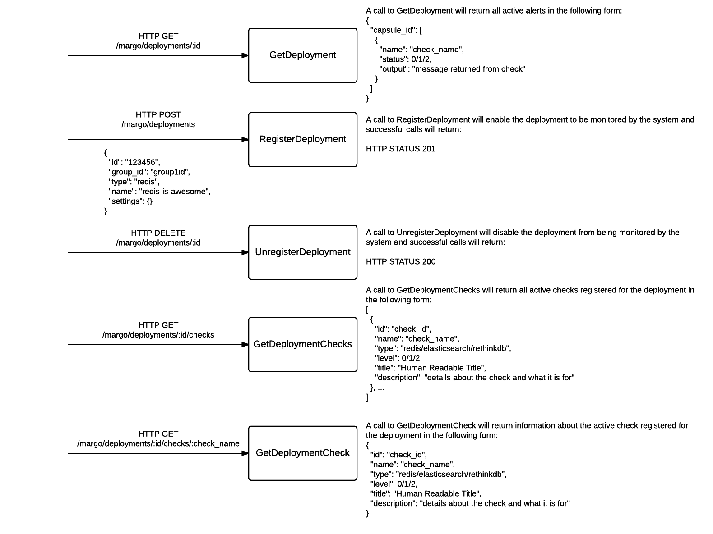
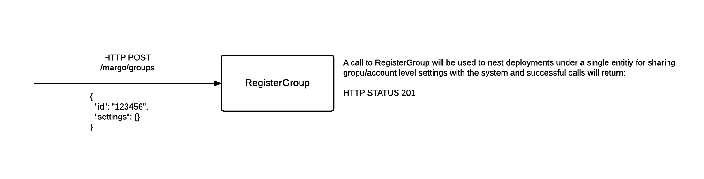
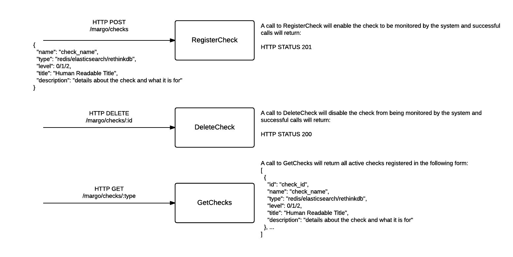

Platform Work Sample (Services)
===============================

The contained project serves as the backend/service layer of the Platform Engineering work sample.

You'll need a few things setup first before you get going.

###Environment Variables

- REDIS_URL, typically `localhost:6379`
- RETHINK_URL, typically `localhost:28015`
- COMPOSE_SERVICE_PASSWORD, whatever you want

###Services

- Redis
- RethinkDB

To seed the databases with some test data, run the following:

***WARNING***

We do flush the Redis database, so if you have other things you are working on, either start redis on a different port or backup your data

**NOTE**: this work sample was originally created with RethinkDB 2.0.x and [gorethink 1.0.0](https://github.com/dancannon/gorethink/releases/tag/v1.0.0).  Since releasing the work sample both the driver and the database have new minor version releases.  In testing, we found connection issues with new versions of the driver and the database.  You may use the versions that you wish, but we wanted to keep you from pulling your hair out.

```shell
go test -tags=seed
```

To run the app,

```shell
go build ./... && ./platform-ws-services
```

If successful, you should see the following message:

```shell
listening on 8000
```

and if you've seeded the data, you should be able to run:

```shell
curl -u x:$COMPOSE_SERVICE_PASSWORD 'http://localhost:8000/margo/deployments/987654321'
```

which should return:

```shell
{
  "111111": [
    {
      "account": "compose-test",
      "capsule_id": "111111",
      "capsule_name": "redis0",
      "deployment_id": "987654321",
      "name":"redis_role",
      "output": "",
      "status":0
    }
  ]
}
```

##Data Model

###Group
The `Group` model has a 1-to-many association with a `Deployment`. It requires that an `Id` be provided during creation and by default, no `Settings` are configured. When a `Check` comes in that requires a notification, the system will first look at the `Settings` on the `Deployment` model and then fall back to the `Group` model `Settings`. If neither contains the specific integration, no notification is sent.

###Settings
The `Settings` model is part of a `Group` and `Deployment` model. It contains all the necessary information to send a notfication for a particular service (i.e. Slack, Pagerduty, HipChat, Email, etc.).

###Deployment
The `Deployment` model belongs to a `Group` and contains basic information about the customer deployment (i.e. name, account slug, etc.) and also contains `Settings` and an `[]Check`. In order for the system to send a notification for a deployment, two criteria must be met: 1. the check must be registerd with the deployment via the `[]Check` 2. `Settings` must exist for either the `Deployment` or associated `Group`.

###Check
The `Check` model is a "dictionary" of all the checks returned by each deployment type that we wish to act on.

##Sending Test Alerts

You can send an "alert" to the system with the following command:

```shell
curl -u x:jprules -XPOST http://localhost:8000/margo/alerts -d \
'{ \
  "client": "localhost", \
  "check": { \
    "name": "redis0-redis_role", \
    "capsule_name": "redis0", \
    "output": "no master found", \
    "status": 1, \
    "capsule_id": "1324354657687980", \
    "deployment_id": "987654321", \
    "account": "compose" \
  } \
}'
```

Breakdown of each attribute:
- `client`: where the alert came from
- `check`: object
- `check.name`: this is a combination of the alert name and the capsule name; in order for the system to process the alert properly, the first part of the name (i.e. everything before the first `-`) should match the `capsule_name` attribute
- `check.capsule_name`: name of the capsule, typically in the form of redisX, elasticsearchX, mongodbX, etc. where 'X' is a number, 0 is always fine for testing of course
- `check.output`: human readable text regarding the alert
- `check.status`: one of 0/1/2/3 and match with the below constants, if you want to test a notification, set the value to 1, 2, or 3; if you want to resolve a notification, set the value to 0
```Go
const (
  Resolved = iota // 0
  Warning         // 1
  Critical        // 2
  Unknown         // 3
)
```

- `check.capsule_id`: this is somewhat of a random value for testing purposes but you'll want to make the unique across deployments
- `check.deployment_id`: this needs to match up with whatever deployment(s) you have regiesterd with the system; based on the seed data, "987654321" or "13243647586970" are valid values
- `check.account`: whatever your heart desires it's just an identifer for an account in the system

##HTTP Routes

###Deployments


###Groups


###Checks


##Work Sample

- Add the necessary functionality in `listener.go` and `notififer.go` to be able to send notifications based on whether a new or resolved incident has been received (*note*: this should be determinable with the calls to Alerter)
- Implement the Pagerduty (`model_pagerduty.go`) and Slack (`model_slack.go`) notifications by making calls in `notififer.go`, a function `getInfo` has already been provided that extracts the necessary model data from a check

***HINTS:***

- Currently there's no communication channel created between listener and notifier, that's a good place to start
- The models returned in `getInfo` provides all the information meeded to determine whether a specific deployment or group should receive a notification for a particular service


